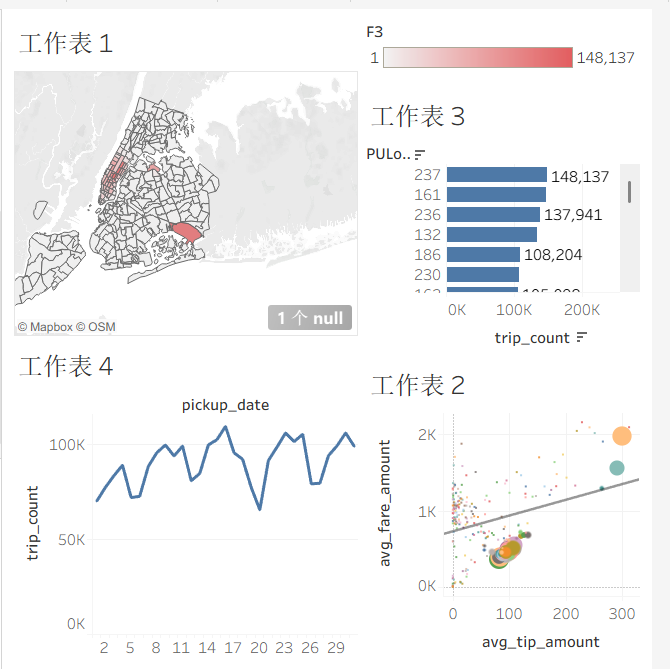

NYC Taxi Data Warehouse Project
📌 项目概述
本项目基于纽约市出租车与礼车委员会（TLC）公开的2025年1月黄色出租车行程数据，构建了一套完整的离线数据仓库。项目涵盖了从数据导入、清洗、建模、性能优化到可视化的全流程，旨在通过真实数据展示大数据开发的工程实践与业务分析能力。

数据规模：约347万条原始行程记录，清洗后281万条

数据来源：NYC TLC Trip Record Data

项目周期：2026年3月

技术栈：Hadoop (HDFS) · Hive · Spark · ORC · Airflow(预留) · Tableau Public · Python

🏗️ 数仓分层架构
采用经典的四层数仓模型，确保数据流转清晰、易于维护：

分层	表名	说明
ODS	ods_taxi_tripdata	原始数据层，存储从CSV导入的原始行程记录。
DWD	dwd_taxi_tripdata	明细数据层，对ODS数据进行清洗、类型转换，并提取时间维度字段，以ORC格式动态分区存储。
DWS	dws_trip_agg_location_day	服务数据层，按区域和日期轻度聚合，计算订单量、平均车费、平均小费等指标。
ADS	ads_trip_summary	应用数据层，为可视化提供最终宽表，包含每日各区域的聚合结果。
🛠️ 核心功能与优化
1. 数据清洗与预处理
过滤脏数据：剔除乘客数≤0、行程距离≤0、车费≤0等不合理记录，清洗后数据量约为281万条（原始数据的81%）。

维度扩展：从时间戳中提取pickup_date、pickup_hour、pickup_weekday，方便后续按时间维度分析。

2. Spark ETL 处理
使用 PySpark 编写 ETL 脚本，从 ODS 表读取原始数据，完成字段类型转换、异常值过滤，并生成时间维度字段。

将清洗后的数据以 ORC 格式、按 pickup_date 动态分区写入 Hive DWD 表，兼顾存储效率与查询性能。

通过 Spark 分布式计算，确保大规模数据下的处理效率，并与 Hive 数仓无缝集成。

3. 性能优化：解决数据倾斜
在 DWS 层按区域聚合时，发现部分热点区域（如机场）数据量远高于其他区域，导致任务执行缓慢。

问题诊断：通过观察 MapReduce 日志，确认存在数据倾斜。

优化方案：采用 加盐两阶段聚合 策略。

第一阶段：给区域 ID 添加随机前缀（0-9），将数据分散到多个临时 key 上进行局部聚合。
第二阶段：去掉前缀，对局部聚合结果进行全局聚合。
优化效果：

聚合方式	执行时间
普通 GROUP BY	78秒
加盐两阶段聚合	44秒
性能提升约43.6%，有效解决了数据倾斜问题。	
4. 任务调度（预留）
项目预留了 Airflow 调度接口，可将整个 ETL 流程（ODS→DWD→DWS→ADS）编排为自动化 DAG，实现 T+1 准时产出。

📊 可视化分析成果
使用 Tableau Public 制作交互式仪表盘，直观展示分析结果。
👉 **[点击此处查看在线仪表盘](https://public.tableau.com/views/dashboard_png/1_1?:language=zh-CN&:sid=&:redirect=auth&:display_count=n&:origin=viz_share_link)**

仪表盘包含以下核心图表：

区域订单分布地图：通过颜色深浅展示纽约市各区域订单量，并关联区域名称，直观识别热点区域。

热门区域订单量排行：条形图展示订单量前10的区域，支持点击筛选联动。

每日订单量趋势：折线图展示整个1月份的订单量变化，可观察工作日与周末的差异。

平均车费 vs 平均小费散点图：点的大小代表订单量，揭示车费与小费的正相关关系，并定位高价值区域。

仪表盘截图位于 visualization/dashboard.png

🚀 如何运行本项目
环境要求
Hadoop 集群（HDFS + YARN）

Hive（支持动态分区）

Spark（用于 ETL，可选）

Airflow（可选，用于调度）

执行步骤
准备数据：从 TLC 官网下载 2025 年 1 月的 Parquet 文件，转换为 CSV 并上传至 HDFS 的 /data/taxi_csv/ 目录。

创建 ODS 层：执行 hive/ods.sql 创建外部表指向 CSV 文件。

运行 Spark ETL：使用 spark-submit 提交 etl/spark_etl_taxi.py，将数据清洗后写入 DWD 表。

构建 DWS 层：执行 hive/dws.sql 生成轻度聚合表。

构建 ADS 层：执行 hive/ads.sql 生成可视化宽表。

导出数据：将 ADS 表导出为 CSV 并下载到本地。

可视化：在 Tableau 中连接 CSV 文件，制作仪表盘。

📂 项目结构
text
nyc-taxi-data-warehouse/
├── README.md
├── .gitignore
├── hive/
│   ├── ods.sql
│   ├── dwd.sql
│   ├── dws.sql
│   └── ads.sql
├── etl/
│   └── spark_etl_taxi.py          # Spark ETL 核心脚本
├── scripts/
│   └── run_pipeline.sh             # 一键执行脚本（可选）
├── docs/
│   └── optimization.md              # 优化记录
├── visualization/
│   └── dashboard.png                # Tableau 截图
├── airflow/                          # 预留调度脚本
└── spark/                            # 预留 Spark 分析脚本
📝 总结与收获
完整实践了大数据离线数仓的搭建流程，掌握了 Hive 分区、动态分区、ORC 存储等关键技术。

通过加盐两阶段聚合有效解决数据倾斜问题，提升了聚合任务性能。

运用 Spark 实现 ETL 流程，体现了多引擎协同能力。

从数据处理到可视化落地的端到端经验，为后续深入大数据开发打下坚实基础